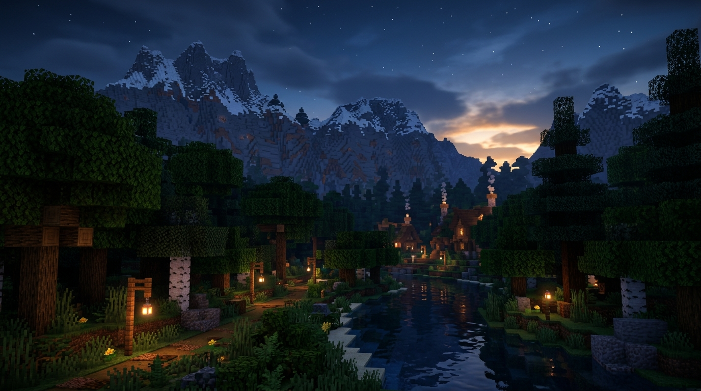

# 🌌 VayuClient™

<div align="center">



**The High-Performance, Next-Gen Native Minecraft Desktop Launcher**

[](https://github.com/ANSH9BOSS/VayuClient)
[](https://dotnet.microsoft.com/)
[](https://github.com/ANSH9BOSS/VayuClient/releases/latest)
[](LICENSE)
[](https://github.com/ANSH9BOSS)

[**📥 Download Latest Installer (`VayuClientSetup.exe`)**](https://github.com/ANSH9BOSS/VayuClient/releases/latest) • [**✨ Release Notes**](https://github.com/ANSH9BOSS/VayuClient/releases) • [**📖 Documentation**](#-architecture--features)

</div>

---

## ⚡ Overview

**VayuClient™** is a modern, high-performance Minecraft desktop launcher engineered in C# (.NET 8.0 WPF). Designed with a modern glassmorphism UI, hardware-accelerated DirectX composition, and complete multi-instance isolation, VayuClient delivers seamless gameplay, automated mod management, and instant 1-click modpack installations.

---

## ✨ Key Features

### 🚀 Performance & Memory Optimization
- **Discrete GPU Acceleration**: Forces high-performance discrete NVIDIA & AMD graphics adapters on Windows.
- **JVM Preset Profiles**: One-click switching between *Sodium Boost (High FPS)*, *Aikar's Low-Latency G1GC*, and *Low Memory Saver*.
- **Smart Java Detection Engine**: Probes and selects optimal LTS Java runtimes (Java 21 for 1.20.5+, Java 17 for 1.18–1.20.4, Java 8 for legacy Minecraft), preventing ASM bytecode compatibility crashes.
- **Sub-50ms Launch Profiler**: Zero-stutter startup with asynchronous dependency injection and lazy-loaded views.

### 🧩 Complete Mod & Modpack Ecosystem
- **In-Jar Mod Icon Extraction**: Automatically inspects `.jar` files for Fabric, Forge, NeoForge, and Quilt metadata to display high-resolution mod logos directly in the UI.
- **Modrinth Marketplace Integration**: Full in-app search for Mods, Modpacks, Resource Packs, Shaders, and Data Packs with real-time download progress.
- **Target Instance Selector**: Mandatory destination instance selector preventing mods from being installed into incorrect versions or directories.
- **Horizontal Showcase Carousels**: Quick-discovery shelves for trending modpacks and performance packs.

### 🎨 Sleek Glassmorphism & Customization
- **Vibrant Minecraft Background Themes**: Switch between *Cyber Nether*, *Lush Caves*, *Mountain Aurora*, *Ocean Monument*, *Cherry Grove*, *Fantasy Sky Islands*, and *Epic Minecraft Hero*.
- **Background Vibrancy Slider**: Adjustable background opacity (10%–80%) with dual-stop glassmorphism gradient overlays.
- **Deep OLED Dark Mode & 60 FPS Transitions**: Ultra-smooth animations and crisp high-DPI font rendering (Inter & JetBrains Mono).

### 🛡️ Multi-Instance Isolation & Account Security
- **Independent Game Directories**: Each instance features its own isolated `mods/`, `config/`, `saves/`, and `resourcepacks/` folders.
- **Microsoft OAuth & Offline Profiles**: Secure Microsoft MSA authentication with token sanitization and offline LAN testing profiles.
- **Discord Rich Presence**: Live custom status showing current Minecraft version, mod loader, and server activity.
- **GitHub 1-Click Auto-Updater**: Instant in-app update checks and automated installer execution directly from GitHub Releases.

---

## 🛠️ Tech Stack & Architecture

- **Runtime**: .NET 8.0 (Windows Desktop / WPF Native)
- **Architecture**: MVVM (CommunityToolkit.Mvvm) with decoupled Service Layer
- **Graphics Engine**: DirectWrite, DirectX 12 / DWM Hardware Composition
- **JSON Serialization**: `System.Text.Json` & `Newtonsoft.Json` (High-speed stream parsing)
- **API Services**: Official Mojang Version Manifest v2 & Modrinth API v2

---

## 📥 Installation

### Option 1: Standalone Installer (Recommended)
1. Download **[`VayuClientSetup.exe`](https://github.com/ANSH9BOSS/VayuClient/releases/latest)** from the latest release.
2. Run the installer and choose your preferred destination directory.
3. Launch **VayuClient** from your Desktop or Start Menu.

### Option 2: Build from Source

#### Prerequisites:
- [.NET 8.0 SDK](https://dotnet.microsoft.com/download/dotnet/8.0) or higher
- Visual Studio 2022 (with .NET Desktop Development workload) or VS Code

#### Steps:
```powershell
# 1. Clone the repository
git clone https://github.com/ANSH9BOSS/VayuClient.git
cd VayuClient

# 2. Build the solution in Release mode
dotnet build -c Release

# 3. Run the application
dotnet run --project .\VayuClient\VayuClient.csproj -c Release

# 4. (Optional) Build standalone Setup Installer
powershell -ExecutionPolicy Bypass -File .\build-setup.ps1
```

---

## 🧪 QA & Automated Testing

VayuClient includes an integrated runtime validation suite verifying 14 subsystems including version resolution, download integrity, Java probing, and UI navigation:

```powershell
# Run the automated QA suite
dotnet run --project .\VayuClient\VayuClient.csproj -c Release -- --qa
```

---

## 👨‍💻 Author & Credits

- **Lead Developer**: **ANSH9BOSS** ([GitHub Profile](https://github.com/ANSH9BOSS))
- **Project**: VayuClient™ Native Minecraft Desktop Platform

---

## 📄 License

This project is licensed under the [MIT License](LICENSE).
