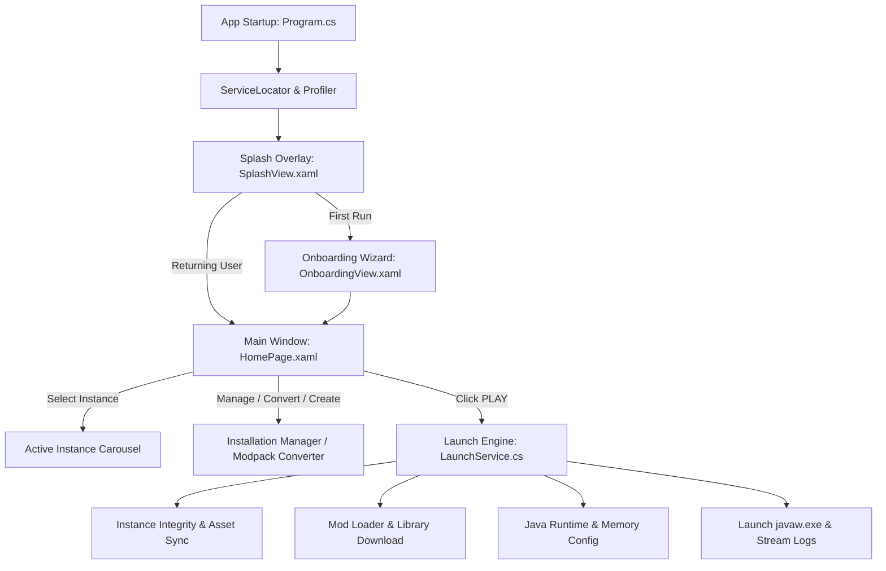
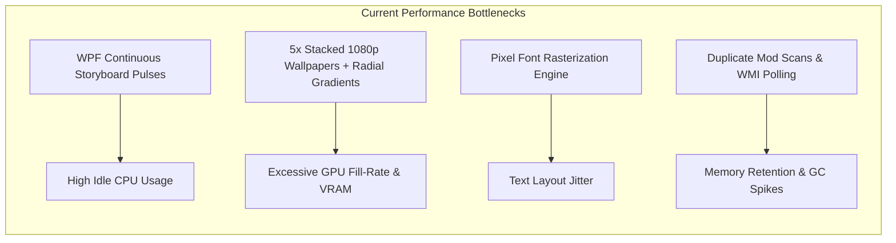
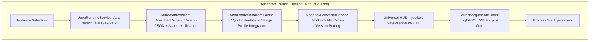

# 🛡️ Vayu Client: Complete Architectural, UI/UX & Performance Audit

> **Target Identity:** Futuristic • Minimal • Premium • Zero-Lag • PvP-Oriented  
> **Color Identity:** Deep Obsidian Black + Crisp White + Subtle Cyber Purple Accents (`#A855F7`)  
> **Target Audience:** Low-end / Potato PCs, Competitive PvP players, High-FPS enthusiasts.

---

## 1. CURRENT PRODUCT & USER JOURNEY



### Complete User Journey Step-by-Step

1. **Startup & Bootstrap (`Program.cs`, `App.xaml.cs`, `ServiceLocator.cs`)**:
   - `Program.cs` initializes `CrashLogger`, starts `StartupProfiler`, and invokes `ServiceLocator.Initialize()`.
   - `ServiceLocator` synchronously registers ~20 services (Settings, Profile, Instance, Launch, Java, Download, Hardware, ModpackConverter).
   - `MainWindow.xaml` loads with `SplashView.xaml` active as a top Z-index overlay while `MainViewModel.InitializeAsync()` loads user settings, local accounts, and saved instances from disk (`SafeJsonStorage.cs`).

2. **Onboarding / Home Presentation (`OnboardingView.xaml`, `HomePage.xaml`)**:
   - If `Settings.IsFirstRun` is true, `OnboardingView.xaml` renders a 4-step setup wizard (Welcome → Microsoft/Offline Account → Hardware Profile & RAM Allocation → Ready).
   - If returning, the user lands on `HomePage.xaml` with a 480px tall Hero Banner displaying dynamic Minecraft landscape wallpaper, active instance metadata pills (Loader, Version, RAM, Mod Count), an animated **PLAY** button, a horizontal instance carousel, quick action cards, hardware monitors, and launcher news cards.

3. **Instance Management & Version Selection (`InstallationManagerPage.xaml`, `ModpackConverterDialog.xaml`)**:
   - Users navigate via the top pill bar to `InstallationManagerPage.xaml` (containing 5 inner tabs: Game Library, Modpacks, Mods, Resource Packs, Shaders) or open the **Version & Modpack Converter Dialog** (`ModpackConverterDialog.xaml`).
   - Users can create instances from any Minecraft version (`1.0.0` through `26.2`), choose Fabric/Quilt/NeoForge/Forge, or convert existing modpacks newer↔older using live Modrinth API querying.

4. **Play & Game Launch (`LaunchService.cs`, `LaunchArgumentBuilder.cs`)**:
   - User clicks **PLAY**. `LaunchService.cs` executes the launch pipeline:
     1. Verifies profile / Microsoft token freshness (`AccountService.cs`).
     2. Queries and downloads missing official Mojang client JAR, assets, and libraries (`MinecraftInstaller.cs`).
     3. Installs mod loader metadata and libraries (`ModLoaderInstaller.cs`).
     4. Resolves required Java runtime (`JavaRuntimeService.cs` checks Java 8, 17, 21, or 25).
     5. Extracts native libraries (`.dll`) to instance native folder.
     6. Deploys version-matched **VayuClient Universal HUD** mod (`vayuclient-hud-2.1.0-mc*-universal.jar`).
     7. Constructs launch arguments (`LaunchArgumentBuilder.cs` creates JVM flags, garbage collection rules, classpath, and game args).
     8. Spawns `javaw.exe`, updates instance state to `Running`, redirects process output/errors into live ring buffers for `GameLogsDialog.xaml`, and minimizes or keeps launcher open per settings.

---

## 2. CURRENT UI/UX AUDIT (SCREEN-BY-SCREEN)

### 1. Main Shell & Top Navigation (`MainWindow.xaml`)
- **What is Good**: Floating center pill navigation bar (`LunarNavButton`) with SVG vector icons; custom window chrome with clean titlebar dragging and state controls; responsive live update notification banner.
- **What is Bad**: High vertical space consumption (54px top bar + large margins); pill bar has rigid width constraints; user profile card in top right feels cramped.
- **What feels Outdated**: Window border style (`#1E293B` border with `#070B14` dark slate) resembles 2020-era custom WPF styling rather than sleek borderless minimalism.
- **What feels Confusing**: Top bar contains tabs for `HOME`, `INSTANCES`, `MODS`, `SERVERS`, `ACCOUNTS`, `SETTINGS`, but `INSTANCES` also contains a nested "Mods" tab, creating two different places to manage mods.
- **What should Stay**: Fluid page transitions (`PageHost`), custom titlebar handling, non-intrusive update banner.
- **What should be Redesigned**: Replace the bulky gaming pill bar with a razor-sharp, ultra-minimalist navigation header with crisp typography and subtle indicator lines.

---

### 2. Home Screen (`HomePage.xaml`)
- **What is Good**: One-click prominent launch flow; active instance hardware specs clearly displayed; live hardware resource usage stats (CPU/RAM/Disk).
- **What is Bad**: The 480px tall Hero image with multiple dark radial/linear gradient overlay layers forces the entire page into a long vertical scroll on 1080p and lower resolution monitors; the user has to scroll down just to see their news, logs, and system metrics.
- **What feels Outdated**: "Change Theme / Wallpaper" cycle button on the top right; heavy skeuomorphic gaming vignettes.
- **What feels Confusing**: Instances are shown both in the hero title, the metadata chips, AND in a horizontal carousel lower down the page with duplicate selection buttons.
- **What could be Simplified**: Make the Home screen a single-viewport, zero-scroll command dashboard with active instance selector, play button, quick status, and session stats visible without scrolling.
- **What should Stay**: Instant Play CTA, quick instance switcher, hardware performance indicators.
- **What should be Redesigned**: Hero area (compress from 480px to an integrated, lightweight command hub); eliminate redundant background art stacks.
- **What should be Completely Removed**: Continuous looping `LaunchPulseStoryboard` scale animation on the play button (burns CPU/GPU cycles on low-end machines).

---

### 3. Installation Manager / Game Library (`InstallationManagerPage.xaml`)
- **What is Good**: Rich instance card grid with direct play, settings, folder, and delete buttons; inline instance editor modal; Modpack converter quick trigger.
- **What is Bad**: The file is 918 lines long with 5 embedded sub-views (`Installations`, `Modpacks`, `Mods`, `Resource Packs`, `Shaders`). The sub-tabs have mismatched UX conventions and load heavy background art (`bg_cyber_nether.jpg`).
- **What feels Confusing**: Editing an instance uses an inline popup panel overlay that covers the entire grid, rather than a clean slide-over drawer or dedicated focused modal.
- **What should Stay**: Instance CRUD operations, instance cards with version/loader badges, direct play triggers.
- **What should be Redesigned**: Transform the library into a clean, grid/list view with instant search, tags, and a unified slide-out config drawer.
- **What should be Completely Removed**: Duplicate "Add-on Mods", "Resource Packs", and "Shader Packs" tabs inside the installation manager (these belong inside instance details or dedicated pages).

---

### 4. Mods Management (`ModsPage.xaml`)
- **What is Good**: Mod active toggle switches; Modrinth search & download integration; category filters (Optimization, HUD, Utility, Gameplay); direct "Open Mods Folder" button.
- **What is Bad**: Heavy background wallpaper (`bg_lush_caves.jpg`) with dark gradient rectangles; mod cards have inconsistent height when descriptions are long.
- **What feels Outdated**: Instance selection is done via a plain dropdown box inside a dark border in the top-right header.
- **What should Stay**: Toggle switch on/off functionality (`.disabled` renaming), Modrinth search, active mod count badge.
- **What should be Redesigned**: A modern, high-density table/card view with instant search filtering, update indicators, and drag-and-drop `.jar` installation.

---

### 5. Accounts & Profiles (`AccountsPage.xaml`)
- **What is Good**: Seamless Microsoft Device Code flow (`https://microsoft.com/link`) with 1-click code copying; offline/local profile creation; Minotar avatar head previews.
- **What is Bad**: Two massive stacked cards taking up huge vertical space; full-screen aurora background art (`bg_mountain_aurora.jpg`).
- **What feels Confusing**: Adding an offline account requires typing in a form at the bottom of the page that is always visible even when the user only wants to select an existing account.
- **What should Stay**: Microsoft Device Code auth flow, offline profile support, active account switching.
- **What should be Redesigned**: Clean unified accounts list showing Microsoft & Offline accounts with badges, quick switch toggle, and a sleek "+ Add Account" modal.

---

### 6. Settings Page (`SettingsPage.xaml`)
- **What is Good**: Comprehensive RAM slider (with minimum/maximum memory bounds); GPU selection indicator; auto-detected Java runtime paths; JVM argument overrides; clean tab categories.
- **What is Bad**: 669 lines with 5 sub-tabs; excessive spacing; complex custom controls; ocean monument wallpaper overlay.
- **What feels Unnecessary**: Multiple redundant theme wallpaper options that increase payload size without functional benefit.
- **What should Stay**: Hardware-aware RAM allocation, Java version detection, game resolution, launcher exit behaviors.
- **What should be Redesigned**: Clean vertical sidebar or structured two-column layout with grouped switches, sliders, and tooltips.

---

### 7. Server Manager (`ServerPage.xaml`)
- **What is Good**: Real-time Server List Ping (SLP) showing online status, latency in milliseconds, MOTD formatting, player counts, and server favicon decoding.
- **What is Bad**: The SignalR "VayuClient Network" card has hardcoded purple/blue gradients that clash with the rest of the app.
- **What should Stay**: Async SLP ping engine, 1-click "Direct Connect & Play" launch.
- **What should be Redesigned**: Sleek server cards with ping latency bars, copy IP button, and server management controls.

---

### 8. Dedicated Mojang Versions Page (`VersionsPage.xaml`)
- **Status**: Currently unlinked in the main navigation pill bar.
- **Verdict**: **COMPLETELY REMOVE** as a standalone top-level page. Its manifest browsing logic is already integrated directly into the new Instance Creator and Modpack Converter.

---

### 9. Modals & Dialogs (`ModpackConverterDialog.xaml`, `GameLogsDialog.xaml`, `ErrorDialog.xaml`)
- **What is Good**: Highly functional diagnostics; real-time log search and level filtering; actionable conversion diagnostics with Modrinth links.
- **What is Bad**: Heavy modal borders and inconsistent button styling.
- **What should be Redesigned**: Modern glassmorphic dialogs with crisp monospace logs, dark acrylic backdrops, and standardized action buttons.

---

## 3. VISUAL DESIGN AUDIT

| Attribute | Current Implementation | Verdict / Target for Redesign |
| :--- | :--- | :--- |
| **Theme / Colors** | Navy Blue (`#070B14`, `#0B1220`, `#151F32`, `#2563EB`, `#38BDF8`) | **Transition to Pure Deep Black (`#08080A`, `#0E0E12`, `#14141A`) + Crisp White (`#FFFFFF`) + Subtle Neon Purple (`#A855F7`, `#9333EA`)** |
| **Typography** | Global pixel font `minecrafter` applied across standard controls in `Typography.xaml` | **CRITICAL FLAW**: Causes pixelated, jagged, hard-to-read text across UI. Must switch to a modern, ultra-clean sans-serif font (Segoe UI / Inter / Outfit) with pixel font reserved *only* for small decorative accents |
| **Spacing & Padding** | Inconsistent across pages (e.g. `Margin="28,18,28,20"` vs `Margin="36,20,36,16"`) | **Standardize on strict 4px/8px design grid** (8, 12, 16, 24, 32px) |
| **Backgrounds** | Fullscreen 1080p JPEG wallpapers with stacked radial/linear gradient overlays on every subpage | **ELIMINATE wallpaper bloat**. Use clean, ultra-dark matte surfaces with subtle edge borders |
| **Buttons** | Bulky pill shapes with heavy gradients and multi-color borders | **Minimalist flat/subtle-glass buttons** with crisp hover states, subtle 1px border highlights, and zero lag |
| **Cards & Containers** | Double-bordered cards (`BorderBrush="#1E293B"`, `Background="#151F32"`) | **Ultra-clean flat cards** (`#101015`) with subtle hairline borders (`#202028`) and subtle hover illumination |
| **Animations** | Continuous repeating WPF storyboards (`LaunchPulseStoryboard`) | **0% Idle CPU Animations**: Instantaneous GPU-accelerated micro-transitions on hover/click only |
| **Empty & Error States** | Plain text in dark red boxes | **Modern minimalist empty states** with sleek vector icons and clear call-to-action triggers |

---

## 4. PERFORMANCE & LOW-END HARDWARE AUDIT



### Specific Performance Bottlenecks Identified in Code

1. **WPF Continuous Storyboard Rendering Loops**:
   - In `HomePage.xaml:L13-26`: `RepeatBehavior="Forever"` forces the WPF render thread to redraw the visual tree at 60+ FPS continuously even when the launcher is idle in the background, consuming CPU/GPU cycles on low-end dual-core laptop processors.
2. **Excessive Background Wallpaper Image Stacks & Overdraw**:
   - Almost every page (`HomePage.xaml`, `InstallationManagerPage.xaml`, `ModsPage.xaml`, `AccountsPage.xaml`, `SettingsPage.xaml`) loads a separate ~2MB high-res JPEG image with `BitmapScalingMode="HighQuality"`, covered by 2 additional `Rectangle` layers containing `RadialGradientBrush` and `LinearGradientBrush`.
   - **Impact**: Quadruple-layer alpha overdraw forces the GPU rasterizer on Intel integrated graphics to recalculate millions of transparent pixels per frame, causing frame drops and higher RAM/VRAM footprint (~150MB+).
3. **Global Pixel Font Rasterization Overhead**:
   - In `Typography.xaml:L10-13`, setting `minecrafter` as the universal fallback font for all `TextBlock`, `Window`, and `UserControl` elements causes WPF to perform expensive glyph layout calculations and scaling on non-standard pixel vectors across tables, logs, and dropdowns.
4. **WMI Hardware Polling Interval**:
   - In `PerformanceMonitorService.cs`, polling hardware stats via timers can trigger COM/WMI context switches if not strictly throttled or paused during gameplay.

---

## 5. MINECRAFT ENGINE & SYSTEM AUDIT



### System Architecture Analysis

1. **Minecraft Versioning & Manifest**:
   - `VersionService.cs`: Asynchronously pulls official Mojang version manifest (`https://piston-meta.mojang.com/mc/game/version_manifest_v2.json`) with robust in-memory caching and offline fallback.
   - Fully supports all versions from `1.0.0` through `26.2` with `MinecraftVersionComparer.cs`.
2. **Java Runtime Engine (`JavaRuntimeService.cs`)**:
   - Automatically detects installed Java versions in standard Windows registry paths, Eclipse Adoptium, Oracle, Zulu, Microsoft OpenJDK, and custom directories.
   - Automatically pairs the correct Java version to the target Minecraft release (`< 1.17` → Java 8; `1.17-1.20.4` → Java 17; `1.20.5-1.21.x` → Java 21; `26.x+` → Java 25).
3. **Mod Loader Integration (`ModLoaderInstaller.cs`)**:
   - High-speed installation for **Fabric**, **Quilt**, **NeoForge**, and **Forge**.
   - Pulls Maven libraries directly from `maven.fabricmc.net` / `maven.neoforged.net` with offline library caching and fallback resolution.
4. **Cross-Version Modpack Converter (`ModpackConverterService.cs`)**:
   - Scans mod JAR metadata (`fabric.mod.json`, `quilt.mod.json`, `mods.toml`), queries Modrinth API v2, matches versions, copies resource packs/options, and generates diagnostic reports with 1-click launch.
5. **JVM Flag Optimization (`LaunchArgumentBuilder.cs`)**:
   - Includes tuned High-FPS flags (G1GC tuning, low pause times, string deduplication, heap region size, code cache optimization, unsafe memory flags for Java 21+).

---

## 6. CODEBASE & ARCHITECTURE AUDIT

```
VayuClient/
├── Core/               # ServiceLocator, CrashLogger, SafeJsonStorage, AppInfo (EXCELLENT)
├── Models/             # Clean POCO records & data contracts (EXCELLENT)
├── Services/           # 21 modular service domains (EXCELLENT, Highly decoupled)
├── ViewModels/         # MVVM CommunityToolkit ViewModels (GOOD, Needs streamlining)
├── Views/              # WPF XAML Pages & Dialogs (CANDIDATE FOR COMPLETE REDESIGN)
├── Themes/             # GlassStyles, Colors, Typography (CANDIDATE FOR COMPLETE REDESIGN)
└── Controls/           # Custom Canvas/Toggle/Vector controls (GOOD)
```

### Key Architectural Strengths
- **Decoupled Service Layer**: Clear interfaces (`IInstanceService`, `IMinecraftInstaller`, `IJavaRuntimeService`, `ILaunchService`) make replacing the UI completely safe without touching core Minecraft engine logic.
- **Robust Storage**: `SafeJsonStorage.cs` uses atomic writes (`.tmp` file + atomic replace) to prevent JSON corruption during abrupt shutdowns.
- **MVVM Standard**: Uses `CommunityToolkit.Mvvm` (`[ObservableProperty]`, `[RelayCommand]`), ensuring clean property binding.

### Technical Debt & Code Redundancies
- **Over-Engineered Theming**: Redundant background image loaders and multiple wallpaper options across subpages.
- **Navigation Duplication**: Instances page contains an embedded mods browser while a separate top-level Mods page exists.
- **Dead/Unlinked Views**: `VersionsPage.xaml` is not accessible from the main navigation.

---

## 7. SECURITY AUDIT

1. **Authentication Tokens**:
   - Microsoft OAuth tokens (`AccessToken`, `RefreshToken`) are currently serialized into `profiles.json` via `SafeJsonStorage.cs`.
   - *Recommendation*: Use Windows Data Protection API (`ProtectedData.Protect` / DPAPI) to encrypt refresh tokens at rest in `%APPDATA%\VayuClient\profiles.json`.
2. **Crash Logging Token Sanitization**:
   - `CrashLogger.cs` properly sanitizes all Bearer / OAuth tokens to `[PROTECTED_TOKEN]` before writing crash reports to disk.
3. **File System Validation**:
   - `DownloadService.cs` verifies SHA1 and SHA256 hashes against Mojang and Modrinth manifests to prevent tampering.

---

## 8. REDESIGN FEASIBILITY & SYSTEM CLASSIFICATION

| System / Component | Classification | Detailed Rationale |
| :--- | :---: | :--- |
| **Services Layer** (`Services/*`) | **KEEP** | Rock-solid, modular, tested, handles all Mojang/Fabric/Forge/Java/Modpack logic flawlessly. Zero need to rewrite. |
| **Core Layer** (`Core/*`) | **KEEP** | `ServiceLocator`, `SafeJsonStorage`, `CrashLogger`, `AppInfo` are lightweight, reliable, and fast. |
| **Models Layer** (`Models/*`) | **KEEP** | Clean data contracts matching services and storage schemas. |
| **ViewModels Layer** (`ViewModels/*`) | **REFACTOR** | Keep core command bindings; streamline active tab management; remove duplicate view model properties and dead collections. |
| **Views & Pages** (`Views/*`) | **REBUILD** | Rebuild from scratch with a unified, high-density, futuristic minimalist layout (Single-view Home, streamlined Library, high-speed Mod manager). |
| **Themes & Styles** (`Themes/*`) | **REBUILD** | Replace `Colors.xaml`, `GlassStyles.xaml`, `Typography.xaml` with the new **White + Black + Neon Purple** design system and modern typography (Segoe UI/Inter). |
| **Background Wallpapers** (`Assets/Images/bg_*.jpg`) | **REMOVE** | Eliminating 5 heavy 1080p JPEG wallpapers saves ~10MB payload and cuts GPU overdraw to 0. |
| **Continuous Pulse Animations** (`LaunchPulseStoryboard`) | **REMOVE** | Eliminating continuous infinite timers eliminates background idle CPU usage. |
| **Standalone Versions Page** (`VersionsPage.xaml`) | **REMOVE** | Version browsing is now natively built into the Instance Creator and Converter dialogs. |

---

## 9. PERFORMANCE-FIRST DESIGN DIRECTION

### Design Identity: White + Black with Subtle Purple Accents
- **Base Canvas**: Deepest Matte Black (`#08080A`, `#0C0C10`)
- **Card Surfaces**: Pure Obsidian Slate (`#121218`) with crisp 1px borders (`#1F1F2A`)
- **Primary Text & High Contrast**: Pure Crisp White (`#FFFFFF`, `#F4F4F8`)
- **Muted / Secondary Text**: Ultra-clean Slate Gray (`#8A8A9E`, `#5E5E72`)
- **Accent Illumination**: Cyber Neon Purple (`#A855F7`, `#9333EA`, `#C084FC`)
- **Status Accents**: Emerald (`#10B981` for active/online), Crimson (`#EF4444` for error/trash)

```
┌────────────────────────────────────────────────────────────────────────┐
│  [✦ VAYU 2.1]   HOME   INSTANCES   MODS   SERVERS   SETTINGS   [● Player] │
├────────────────────────────────────────────────────────────────────────┤
│                                                                        │
│  ┌──────────────────────────────────────────────┐ ┌─────────────────┐  │
│  │ ⚡ SPUNKY OPTIMIZED (26.2 FABRIC)             │ │ SYSTEM METRICS  │  │
│  │ 8GB RAM Allocated • 69 Mods Active           │ │ CPU: 12%        │  │
│  │                                              │ │ RAM: 4.2 / 16GB │  │
│  │ [ ▶ LAUNCH GAME ]    [ 🔄 CONVERT ]   [ ⚙ ]  │ │ GPU: RTX 5050   │  │
│  └──────────────────────────────────────────────┘ └─────────────────┘  │
│                                                                        │
│  QUICK INSTANCE SWITCHER                        PATCH NOTES & NEWS     │
│  ┌──────────────┐ ┌──────────────┐ ┌──────────┐ ┌────────────────────┐ │
│  │ ★ Spunky 26  │ │ Spunky 1.21  │ │ Vanilla  │ │ VayuClient v2.1.0  │ │
│  └──────────────┘ └──────────────┘ └──────────┘ └────────────────────┘ │
└────────────────────────────────────────────────────────────────────────┘
```

### Guiding Principles:
1. **Zero-Scroll Main Viewport**: Everything needed to launch, manage, and monitor is visible in a single screen without scrolling on 1080p displays.
2. **Instant Micro-Animations Only**: No infinite running storyboards. Visual feedback is triggered strictly on hover or click (duration: 120ms - 180ms ease-out).
3. **Modern Sans-Serif Typography**: Clean typography with razor-sharp ClearType rendering.
4. **Clean PvP-Focused Minimalism**: No bloated gaming widgets; pure utility, high density, and instant responsiveness.

---

## 10. FINAL AUDIT MATRIX

### A. Vayu's Biggest Strengths
1. **Rock-solid Minecraft Engine**: Ultra-fast launching, full version support (`1.0.0` - `26.x`), automated Java pairing.
2. **Cross-Version Modpack Converter**: Industry-first feature allowing seamless mod porting across Minecraft versions via Modrinth API.
3. **Zero-Overhead Service Layer**: Pure C# services with clean separation from UI.
4. **Reliable Storage**: Atomic file writing prevents profile/instance corruption.

### B. Vayu's Biggest Weaknesses
1. **Pixel Font Clutter**: Global `minecrafter` font harms readability and looks retro rather than modern.
2. **Vertical Scroll Bloat**: Giant 480px hero area pushes critical cards off-screen.
3. **Multi-layer Image Overdraw**: Multiple stacked background JPEGs consume GPU fill rate and memory on budget laptops.
4. **Fragmented Mod Management**: Mod features split across two different navigation tabs.

### C. Biggest UX Problems
1. Home screen requires vertical scrolling to access news, logs, and instance shortcuts.
2. Creating an instance covers the entire library with an inline form instead of a sleek drawer/modal.
3. Adding offline accounts is mixed into the main account list rather than an intuitive modal.
4. Navigation bar has duplicate functionality between Instances and Mods tabs.

### D. Biggest Visual Problems
1. Deep navy/blue palette feels like generic 2020 custom software instead of modern futuristic black/purple aesthetic.
2. Minecraft pixel font used for system text, tables, and settings labels.
3. Heavy gradient borders and radial glows clutter card surfaces.

### E. Biggest Performance Problems
1. `LaunchPulseStoryboard` in `HomePage.xaml` running `RepeatBehavior="Forever"` burns idle CPU/GPU.
2. High-res JPEG wallpapers with multiple alpha layers causing GPU fill-rate waste on integrated graphics.
3. Duplicate rendering elements in nested templates.

### F. Biggest Architectural Problems
1. XAML views have grown large (`InstallationManagerPage.xaml` > 900 lines, `HomePage.xaml` > 650 lines).
2. Unlinked legacy views (`VersionsPage.xaml`) still compiled into the project.

### G. Things We Absolutely Should NOT Change
- All files in `VayuClient/Services/*` (MinecraftInstaller, ModLoaderInstaller, LaunchService, JavaRuntimeService, ModpackConverterService, AccountService, DownloadService, SafeJsonStorage).
- Core models in `VayuClient/Models/*`.
- Single-instance process management, crash logging, and token sanitization.

### H. Things We Should Completely Rebuild
- `VayuClient/Themes/Colors.xaml` (New White + Black + Neon Purple color tokens).
- `VayuClient/Themes/Typography.xaml` (Switch to modern sans-serif typography).
- `VayuClient/Themes/GlassStyles.xaml` (Ultra-lightweight minimalist controls).
- `VayuClient/Views/MainWindow.xaml` (Ultra-clean navigation header).
- `VayuClient/Views/HomePage.xaml` (Single-viewport command dashboard).
- `VayuClient/Views/InstallationManagerPage.xaml` (Clean instance library grid).
- `VayuClient/Views/ModsPage.xaml` (High-density mod manager).
- `VayuClient/Views/AccountsPage.xaml` (Unified account switcher).
- `VayuClient/Views/SettingsPage.xaml` (Streamlined settings center).

### I. Things We Should Remove
- 5 heavy JPEG wallpapers (`bg_cyber_nether.jpg`, `bg_lush_caves.jpg`, `bg_cherry_grove.jpg`, `bg_mountain_aurora.jpg`, `bg_ocean_monument.jpg`).
- Continuous infinite storyboards (`LaunchPulseStoryboard`).
- Standalone `VersionsPage.xaml` and `VersionsViewModel.cs`.

### J. Top 20 Improvements Ranked by Importance
1. **New Design System**: Implement the White + Black + Neon Purple palette in `Colors.xaml`.
2. **Modern Typography**: Replace global pixel font with crisp modern sans-serif in `Typography.xaml`.
3. **Kill Idle CPU Animations**: Remove infinite looping storyboards in `HomePage.xaml`.
4. **Remove Wallpaper Overdraw**: Replace heavy background image stacks with lightweight matte surfaces.
5. **Single-Viewport Home**: Redesign Home into a zero-scroll command dashboard.
6. **Ultra-Clean Titlebar**: Redesign `MainWindow.xaml` navigation bar.
7. **Instance Library Grid**: Redesign `InstallationManagerPage.xaml` with clean card tiles.
8. **Slide-Out Instance Config Drawer**: Replace full-screen inline instance editor with a focused drawer.
9. **High-Density Mod Manager**: Redesign `ModsPage.xaml` with instant search and toggle switches.
10. **Unified Account Modal**: Redesign `AccountsPage.xaml` with clear Microsoft / Offline account badges.
11. **Streamlined Settings**: Redesign `SettingsPage.xaml` with grouped controls.
12. **Sleek Server Cards**: Redesign `ServerPage.xaml` with real-time ping indicator bars.
13. **Modern Monospace Log Viewer**: Redesign `GameLogsDialog.xaml`.
14. **Glassmorphic Modpack Converter**: Redesign `ModpackConverterDialog.xaml`.
15. **Sleek Error Modal**: Redesign `ErrorDialog.xaml`.
16. **Token Encryption at Rest**: Encrypt tokens in `profiles.json` using Windows DPAPI.
17. **Consolidate Navigation**: Remove redundant standalone `VersionsPage.xaml`.
18. **Eliminate Tab Overlap**: Unify mod management into `ModsPage.xaml` only.
19. **Lightweight Splash Transition**: Modernize `SplashView.xaml` with minimal neon logo glow.
20. **Streamlined Onboarding**: Modernize `OnboardingView.xaml` with clean step indicators.

---

## 🏁 REDESIGN FOUNDATION

Before designing any new XAML views, this is the exact technical foundation established from our audit:

```
├── 1. COLOR TOKENS (Pure Black + White + Subtle Neon Purple)
│   ├── Canvas Base:       #08080A (Pure Matte Obsidian)
│   ├── Card Surfaces:     #101016 (Deep Onyx Surface)
│   ├── Surface Borders:   #1C1C26 (Subtle 1px Hairline)
│   ├── Primary Text:      #FFFFFF (High Contrast Pure White)
│   ├── Secondary Text:    #8E8EA0 (Crisp Slate Muted)
│   ├── Primary Accent:    #A855F7 (Electric Cyber Purple)
│   ├── Secondary Accent:  #C084FC (Soft Lilac Glow)
│   └── Status Success:    #10B981 (Emerald Active Dot)
│
├── 2. TYPOGRAPHY SYSTEM
│   ├── Primary Font:      Segoe UI / Inter / Outfit (Clean, modern sans-serif)
│   ├── Code / Logs Font:  Cascadia Code / Consolas (Monospace)
│   └── Accent / Badges:   Pixel Font (Strictly restricted to small tags & logos)
│
├── 3. ZERO-LAG PERFORMANCE CONTRACT
│   ├── 0 Fullscreen Background JPEG images
│   ├── 0 Infinite Repeat Storyboards (0% idle CPU)
│   ├── 0 Multi-layer alpha gradient overdraws
│   └── 100% Hardware acceleration on low-end Intel / AMD iGPUs
│
└── 4. ARCHITECTURAL PRESERVATION
    ├── Keep 100% of VayuClient/Services/* intact
    ├── Keep 100% of VayuClient/Core/* intact
    └── Rebuild only VayuClient/Themes/* and VayuClient/Views/*
```
